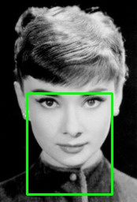
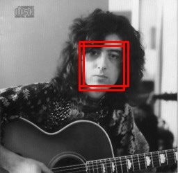
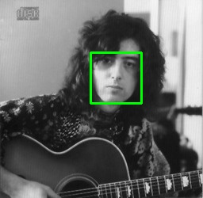
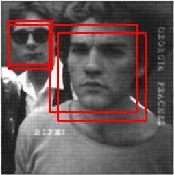
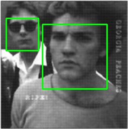

# Non_Maximum_Suppression

## Description
Non-Maximum Suppression for Object Detection in Python
Maximum Suppression (NMS) is a technique used in numerous computer vision tasks. It is a class of algorithms to select one entity (e.g., bounding boxes) out of many overlapping entities. We can choose the selection criteria to arrive at the desired results.

## Test images

   

 

  

    

